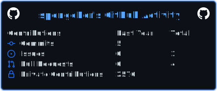

# Hi, I'm spongeB 👋

### Full-stack developer focused on TypeScript, React and engineering systems

  以 TypeScript / React 为主的全栈开发者 
  关注前端工程化、系统设计与开发者工具

  
  
  

---

## 👨‍💻 About me

- 🔭 主要使用 **TypeScript、React 和 Next.js** 构建 Web 应用
- 🧱 关注可维护的架构、工程规范与开发体验
- 🌱 持续学习 **Go、Rust 和 Python**
- 💡 喜欢把复杂问题拆解成简单、可靠的解决方案

## 📈 Contribution activity

  

  
    Includes anonymized contributions from private repositories.
    Repository names and source code remain private.
  

## 🚀 Featured projects

| Project | Description | Stack |
| --- | --- | --- |
| [nextjs-template](https://github.com/spongeBor/nextjs-template) | 基于 Next.js 的 React 工程模板，沉淀常用工程实践 | `TypeScript` `Next.js` `React` |
| [css-secert](https://github.com/spongeBor/css-secert) | CSS / SCSS 效果与实现方式实践 | `SCSS` `CSS` |
| [rust_learning](https://github.com/spongeBor/rust_learning) | Rust 语言学习记录与代码示例 | `Rust` |
| [python_scraping_learning](https://github.com/spongeBor/python_scraping_learning) | Python 数据抓取与自动化实践 | `Python` |

## 🛠 Tech stack

**Languages**

`TypeScript` · `Go` · `Python` · `Rust`

**Frontend**

`React` · `Next.js` · `React Router` · `Taro` · `Tailwind CSS` · `MobX`

**Backend & Data**

`Fastify` · `PostgreSQL` · `MongoDB`

**Engineering**

`Docker` · `Kubernetes` · `GitHub Actions` · `Jenkins` · `AWS`

## 📊 GitHub activity

查看公开仓库统计

 

  
  

  语言卡片根据公开仓库代码体积生成，不代表技术熟练度。

## 💭 Engineering values

> Clear interfaces. Simple abstractions. Reliable systems.

- 优先解决真实问题，而不是堆叠技术
- 用清晰的接口隔离复杂度
- 让代码容易理解、验证和维护
