<div align="center">

<h1>Hi, I'm spongeB 👋</h1>

<p>
  <strong>Full-stack developer focused on TypeScript, React and engineering systems.</strong>
</p>

<p>
  以 TypeScript / React 为主的全栈开发者<br/>
  关注前端工程化、系统设计、开发者工具与可靠的软件架构
</p>

<p>
  <a href="https://github.com/spongeBor?tab=repositories">
    
  </a>
  
  
</p>

</div>

---

## 👨‍💻 About me

- 🔭 主要使用 **TypeScript、React 和 Next.js** 构建 Web 应用
- 🧱 关注前端工程化、系统设计、代码可维护性与开发体验
- ⚙️ 对全栈架构、自动化工具和基础设施感兴趣
- 🌱 持续学习 **Go、Rust 和 Python**
- 💡 喜欢把复杂的问题拆解为简单、可靠的解决方案
- 🔒 主要开发活动来自私有仓库，以下数据以聚合形式展示

## 📈 Engineering activity

<p align="center">
  
</p>

<p align="center">
  <sub>
    Includes aggregated activity from authorized private repositories.
    Private repository names and source code are not displayed.
  </sub>
</p>

> 活跃度面板包含全年贡献日历、连续活跃天数、Commit、Issue、PR、Review、活跃时间分布和聚合语言统计。

## 🚀 Featured projects

| Project | Description | Stack |
| --- | --- | --- |
| [nextjs-template](https://github.com/spongeBor/nextjs-template) | 基于 Next.js 和现代工程工具搭建的 React 项目模板 | `TypeScript` `Next.js` `React` |
| [css-secert](https://github.com/spongeBor/css-secert) | CSS / SCSS 效果、布局与实现方式实践 | `SCSS` `CSS` |
| [rust_learning](https://github.com/spongeBor/rust_learning) | Rust 语言学习记录、基础概念与代码示例 | `Rust` |
| [python_scraping_learning](https://github.com/spongeBor/python_scraping_learning) | Python 数据抓取与自动化实践 | `Python` |

## 🛠️ Tech stack

### Languages

<p>
  
  
  
  
</p>

### Frontend

<p>
  
  
  
  
  
  
</p>

### Backend and data

<p>
  
  
  
  
</p>

### Engineering and infrastructure

<p>
  
  
  
  
  
</p>

## 🧭 Current focus

```text
Frontend engineering   ███████████████████░   TypeScript / React / Next.js
Backend development    ██████████████░░░░░░   Node.js / Fastify / Go
System design          ████████████░░░░░░░░   Architecture / Reliability
Systems programming    ███████░░░░░░░░░░░░░   Rust
