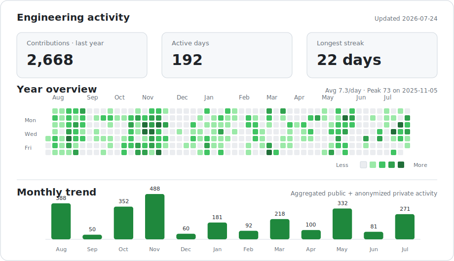

<div align="center">

<p>
  <a href="https://github.com/spongeBor/spongeBor/blob/main/README.md">English</a> ·
  <strong>简体中文</strong>
</p>

<h1>你好，我是 spongeBor 👋</h1>

<p>
  <strong>以前端为核心的全栈工程师 · 关注架构的长期主义构建者</strong>
</p>

<p>
  使用 TypeScript、React 与 Vue 构建可维护的 Web 系统，<br/>
  同时将能力延伸到后端服务、数据、基础设施与系统编程。
</p>

<p>
  <a href="https://github.com/spongeBor?tab=repositories">
    
  </a>
  
  
  
</p>

</div>

---

## 关于我

我是一名 T 型工程师：以前端架构为技术深度，以完整的软件交付链路为能力广度。

- 💼 目前就职于 **[xTool](https://www.xtool.com/)**，参与数字化创作产品的软件研发，重点关注前端架构与工程体系
- 使用 **Codex、Claude Code 与 MCP** 构建 Agent 驱动的研发工作流，覆盖代码库理解、功能实现、测试、文档与工程自动化
- 使用 **TypeScript、React、Vue 与 Next.js** 构建复杂 Web 应用
- 设计可复用的 UI 架构、状态模型以及清晰的模块边界
- 通过 **Node.js、Fastify、Go 与数据服务**打通全栈链路
- 将 **Go** 作为核心语言，用于后端服务、并发任务与工程工具
- 关注性能、可观察性、可维护性与开发者体验
- 使用 **GitHub Actions、Jenkins、Docker 与 Kubernetes** 自动化交付
- 通过 **Rust 与 Python** 拓展系统层面的工程视野
- 日常工程活动主要来自私有仓库，主页仅以聚合数据展示活跃度

## 技术能力图谱

| 领域 | 关注方向 | 技术栈 |
| --- | --- | --- |
| **前端系统** | 应用架构、组件体系、状态管理、路由与性能 | TypeScript、React、Vue、Next.js、Electron、Pinia、MobX、React Router、Vue Router |
| **全栈设计** | API 契约、服务边界、错误处理与集成模式 | Node.js、Fastify、Go |
| **Go 工程** | 后端服务、并发、工程工具与面向系统的设计 | Go |
| **应用型 AI 工程** | Agent 工作流、上下文设计、工具集成、效果评估与人在回路自动化 | Codex、Claude Code、LLM API、MCP |
| **数据层** | 数据建模、持久化、查询设计与应用集成 | PostgreSQL、MongoDB |
| **工程体系** | 构建工具、自动化测试、CI/CD、质量门禁与发布自动化 | Vite、Vitest、Playwright、GitHub Actions、Jenkins、Docker |
| **基础设施** | 容器化工作负载、部署与服务编排 | Docker、Kubernetes |
| **系统探索** | 类型系统、内存安全与自动化 | Rust、Python |

## 技术深度

### 前端架构

- 将复杂产品行为建模为明确的状态与可预测的数据流
- 在适合的场景下，让领域逻辑保持独立于 UI 框架
- 构建可复用组件，同时保留重要的业务语义
- 在渲染性能、代码清晰度与交付效率之间取得平衡

### 系统与 API 设计

- 通过明确的契约连接前端、后端与数据层
- 使用小而清晰的包边界与明确接口构建 Go 后端服务和工程工具
- 通过清晰的所有权、取消机制与错误传播管理并发任务
- 将错误、异步状态和副作用设计为可观察的流程
- 避免业务规则与框架实现产生不必要的耦合
- 根据当前复杂度与未来变化选择合适的抽象层级

### 应用型 AI 工程

- 将 AI 从对话助手转化为可重复、工具驱动的工程工作流
- 通过结构化上下文、提示词、工具契约与安全边界提升 Agent 可靠性
- 使用 MCP 与 API 将 Agent 接入代码库、开发工具和交付流程
- 评估输出质量，并在高影响决策中保留人工审查

### 工程质量

- 让构建、测试、发布和部署流程可重复
- 建立反馈快速、失败可见、诊断可执行的工程流程
- 在优化之前测量，在抽象之前理解业务问题
- 将可维护性视为产品的长期能力

## 工程活跃度

<picture>
  <source media="(prefers-color-scheme: dark)" srcset="assets/github-activity-dark.svg" />
  <source media="(prefers-color-scheme: light)" srcset="assets/github-activity-light.svg" />
  
</picture>

<p align="center">
  <sub>聚合公开贡献与匿名私有贡献 · 每日自动更新</sub>
</p>

## 公开项目

> 大部分生产级工程位于私有仓库。公开仓库主要用于沉淀工程基线、技术实验与学习记录。

| 项目 | 关注方向 | 技术栈 |
| --- | --- | --- |
| [nextjs-template](https://github.com/spongeBor/nextjs-template) | 关注项目结构与可复用工程规范的现代 Next.js 项目基线 | `TypeScript` `Next.js` `React` |
| [css-secert](https://github.com/spongeBor/css-secert) | CSS/SCSS 布局、渲染效果与实现技巧实验 | `SCSS` `CSS` |
| [rust_learning](https://github.com/spongeBor/rust_learning) | 所有权、类型系统与内存安全的学习记录 | `Rust` |
| [python_scraping_learning](https://github.com/spongeBor/python_scraping_learning) | 数据采集、处理与自动化实验 | `Python` |

## 技术栈

### 核心能力

<p>
  
  
  
  
  
  
  
</p>

### AI 工程

<p>
  
  
  
  
  
  
  
  
</p>

### 前端生态

**应用架构**

<p>
  
  
  
  
  
  
  
  
  
  
</p>

**UI 与样式**

<p>
  
  
  
</p>

**工具链与质量**

<p>
  
  
  
  
  
  
  
  
</p>

### 数据与基础设施

<p>
  
  
  
  
  
  
</p>

### 持续探索

<p>
  
  
</p>

## 我的工程方法

```text
理解业务领域
    ↓
定义清晰边界
    ↓
设计明确契约
    ↓
构建最简单可靠的方案
    ↓
测量、验证、持续迭代
```

> 好的工程不是追求最多的抽象，而是让复杂度变得可见、可控、可演进。
